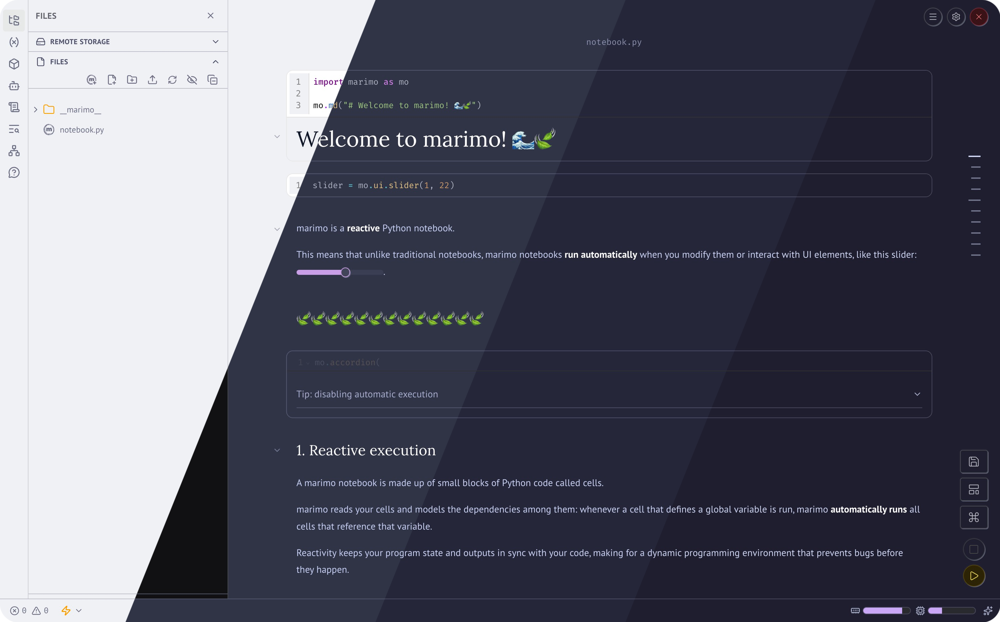
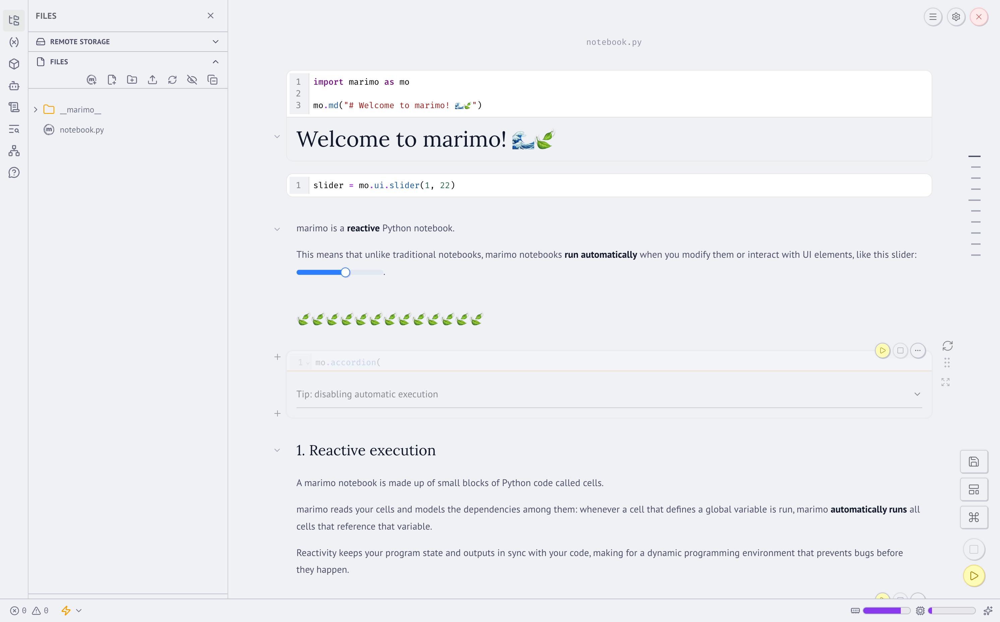
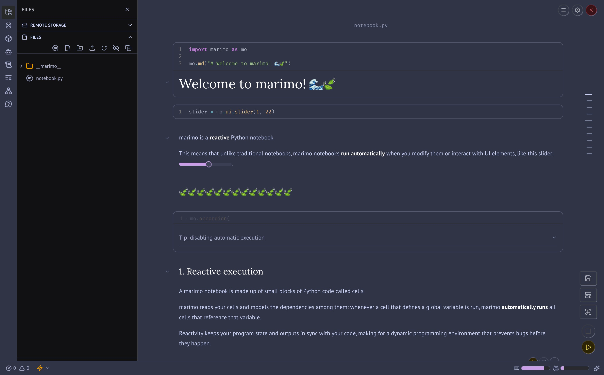
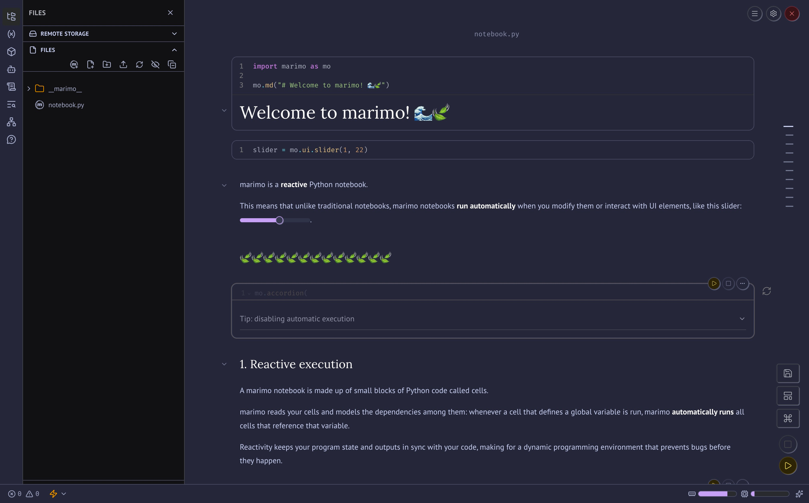
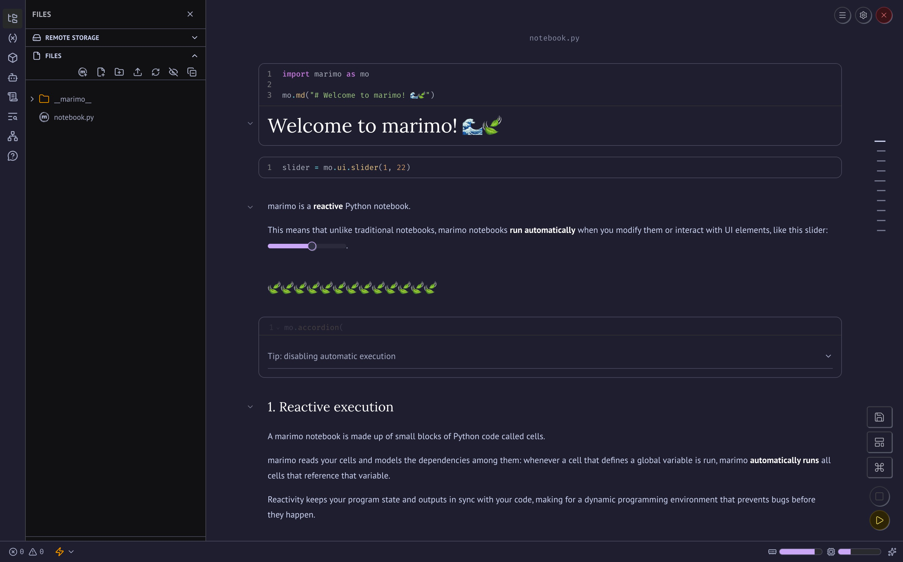

<h3 align="center">
	<br/>
	
	Catppuccin for <a href="https://github.com/marimo-team/marimo">Marimo</a>
	
</h3>

<p align="center">
	<a href="https://github.com/XXXM1R0XXX/marimo/stargazers"></a>
	<a href="https://github.com/XXXM1R0XXX/marimo/issues"></a>
	<a href="https://github.com/XXXM1R0XXX/marimo/contributors"></a>
</p>

<p align="center">
	
</p>

## Previews

<details>
<summary>🌻 Latte</summary>

</details>
<details>
<summary>🪴 Frappé</summary>

</details>
<details>
<summary>🌺 Macchiato</summary>

</details>
<details>
<summary>🌿 Mocha</summary>

</details>

## Usage

Marimo supports custom CSS themes via the `css_file` parameter or the `custom_css` user configuration. Catppuccin for Marimo provides three CSS files, each combining the light Latte palette with one of the three dark palettes (Frappé, Macchiato, or Mocha).

### Per-notebook (recommended)

Pass a CSS file to your `marimo.App` instance:

```python
import marimo

app = marimo.App(css_file="catppuccin-latte-mocha.css")
```

### Global user configuration

Add the theme to your `~/.marimo.toml`:

```toml
[display]
custom_css = ["/path/to/catppuccin-latte-mocha.css"]
```

### Available themes

| File | Light variant | Dark variant |
| --- | --- | --- |
| `catppuccin-latte-frappe.css` | Latte | Frappé |
| `catppuccin-latte-macchiato.css` | Latte | Macchiato |
| `catppuccin-latte-mocha.css` | Latte | Mocha |

## Custom combinations

You can build custom flavor combinations using [Whiskers](https://github.com/catppuccin/whiskers) (the Catppuccin template engine) and [just](https://github.com/casey/just):

```bash
# Install dependencies
brew install catppuccin/tap/whiskers just

# Build a custom combination (e.g. Latte + Mocha)
just build latte mocha

# Build any combination you want
just build latte frappe
```

The generated CSS files use the [`light-dark()`](https://developer.mozilla.org/en-US/docs/Web/CSS/color_value/light-dark) CSS function, so they automatically switch between the light and dark variants based on your system or Marimo theme preference.

## Custom fonts

You can override Marimo's default fonts by building a theme with custom font parameters:

```bash
# Set a custom monospace (code) font
just build-font latte mocha '"Comic Code Ligatures", monospace'

# Font names with spaces must be quoted
just build-font latte mocha '"Comic Code Ligatures", "Fira Mono", monospace'
```

Available font parameters:
- `monospace_font` — code/editor font (overrides `--marimo-monospace-font`)
- `text_font` — body/prose font (overrides `--marimo-text-font`)
- `heading_font` — heading font (overrides `--marimo-heading-font`)

## 🙋 FAQ

- Q: **_"Why are there only three files instead of four?"_**\
  A: Marimo supports two theme modes — light and dark. Catppuccin has one light flavor (Latte) and three dark flavors (Frappé, Macchiato, Mocha), so we combine Latte with each dark flavor to produce three files.

- Q: **_"How do I switch between light and dark modes?"_**\
  A: Marimo automatically follows your system preference when set to `system`, or you can toggle it manually in the Marimo settings. The CSS file uses the `light-dark()` CSS function, so it responds automatically.

- Q: **_"The theme doesn't look right — some colors are still default!"_**\
  A: Make sure the CSS file is loaded correctly. You can verify by opening your browser's DevTools and checking if the CSS custom properties (e.g., `--background`) are overridden.

## 💝 Thanks to

- [m1r0](https://github.com/XXXM1R0XXX)

&nbsp;

<p align="center">
	
</p>

<p align="center">
	Copyright &copy; 2026-present <a href="https://github.com/catppuccin" target="_blank">Catppuccin Org</a>
</p>

<p align="center">
	<a href="https://github.com/catppuccin/catppuccin/blob/main/LICENSE"></a>
</p>